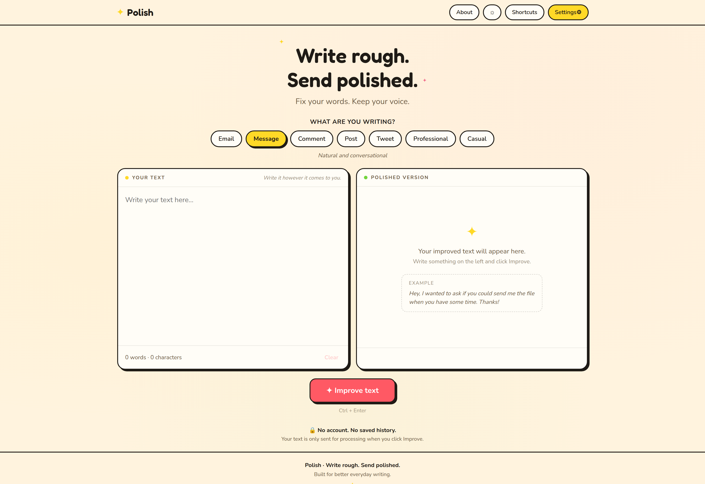

# Polish

> AI-Powered Text Improvement Web Application



Polish is an AI-powered text improvement web application designed to refine, enhance, and transform your writing with precision. Powered by DeepSeek's advanced LLM models, Polish delivers smart rewriting, grammar and style adjustments, tone customization, and concise editing through a clean, modern user interface.

## Features

- **Smart Text Enhancement**: Polish sentences, paragraphs, or full essays with intelligent context-aware suggestions.
- **Multiple Writing Tones & Modes**: Adjust tone between professional, casual, academic, persuasive, or creative.
- **Grammar & Syntax Correction**: Fix spelling errors, grammatical mistakes, and punctuation with accurate explanations.
- **Concise & Clarity Rewriting**: Eliminate wordiness, passive voice, and improve readability.
- **Real-Time Streaming**: Fast AI responses streamed directly to the editor.
- **Docker-Ready**: Fully containerized multi-stage production builds and simple local deployment.

## Requirements

- **Node.js**: 20.x or higher
- **npm**: 10.x or higher
- **Docker**: Engine 24+ (optional, for containerized deployment)
- **Docker Compose**: v2+ (optional, for container orchestration)
- **Make**: Standard GNU Make

## Quick Start

1. **Clone the repository**:
   ```bash
   git clone <repository-url>
   cd auto-pen
   ```

2. **Set up environment variables**:
   ```bash
   cp .env.example .env
   ```

3. **Configure your API key**:
   Open `.env` and add your DeepSeek API key:
   ```env
   DEEPSEEK_API_KEY=your_deepseek_api_key_here
   ```

4. **Install dependencies**:
   ```bash
   make install
   # or: npm install
   ```

5. **Start development server**:
   ```bash
   make dev
   # or: npm run dev
   ```
   Open [http://localhost:3000](http://localhost:3000) in your browser.

## Docker

Run Polish using Docker and Docker Compose without requiring a local Node.js environment:

- **Build Docker image**:
  ```bash
  make docker-build
  # or: docker compose build
  ```

- **Start Docker services**:
  ```bash
  make docker-up
  # or: docker compose up -d
  ```

- **View container logs**:
  ```bash
  make docker-logs
  # or: docker compose logs -f
  ```

- **Stop Docker services**:
  ```bash
  make docker-down
  # or: docker compose down
  ```

## Development

Common development workflows:

- **Start dev server**:
  ```bash
  make dev
  ```

- **Run tests**:
  ```bash
  make test
  ```

- **Run TypeScript type checking**:
  ```bash
  make typecheck
  ```

- **Run linter**:
  ```bash
  make lint
  ```

- **Run all verification checks** (lint, typecheck, test, build):
  ```bash
  make verify
  ```

## Available Commands

All primary development and deployment commands are managed via `Makefile`:

| Command | Description |
|---|---|
| `make help` | Show available Makefile commands |
| `make install` | Install project dependencies via `npm install` |
| `make dev` | Start development server with hot-reload |
| `make build` | Build production application bundle |
| `make start` | Start production server |
| `make stop` | Stop running production server |
| `make restart` | Restart production server |
| `make logs` | Show application logs |
| `make test` | Run test suites |
| `make lint` | Run ESLint checks |
| `make typecheck` | Run TypeScript type checking |
| `make verify` | Run all quality checks (`lint`, `typecheck`, `test`, `build`) |
| `make docker-build` | Build Docker image |
| `make docker-up` | Start Docker services in detached mode |
| `make docker-down` | Stop Docker services |
| `make docker-logs` | Stream Docker container logs |
| `make clean` | Remove generated files (`.next`, `node_modules`, `coverage`, `out`, `build`) |

## Environment Variables

Configure the application using the following environment variables:
Configure the application using the following environment variables (or provide your key directly in the in-app Settings UI):

| Variable | Required | Default | Description |
|---|---|---|---|
| `DEEPSEEK_API_KEY` | **Yes** | — | API key for authenticating with DeepSeek API |
| `AI_PROVIDER` | No | `deepseek` | Active provider (`deepseek`, `openai`, `anthropic`, `gemini`, `groq`, `openrouter`, `custom`) |
| `DEEPSEEK_API_KEY` | Optional | — | DeepSeek API key |
| `DEEPSEEK_MODEL` | No | `deepseek-chat` | DeepSeek LLM model identifier |
| `DEEPSEEK_BASE_URL` | No | `https://api.deepseek.com` | Base URL for the DeepSeek API endpoint |
| `DEEPSEEK_BASE_URL` | No | `https://api.deepseek.com` | Base URL for DeepSeek endpoint |
| `OPENAI_API_KEY` | Optional | — | OpenAI API key |
| `OPENAI_MODEL` | No | `gpt-4o-mini` | OpenAI model identifier |
| `OPENAI_BASE_URL` | No | `https://api.openai.com` | Base URL for OpenAI endpoint |
| `ANTHROPIC_API_KEY` | Optional | — | Anthropic Claude API key |
| `ANTHROPIC_MODEL` | No | `claude-3-5-haiku-20241022` | Anthropic model identifier |
| `ANTHROPIC_BASE_URL` | No | `https://api.anthropic.com` | Base URL for Anthropic endpoint |
| `GEMINI_API_KEY` | Optional | — | Google Gemini API key |
| `GEMINI_MODEL` | No | `gemini-2.0-flash` | Google Gemini model identifier |
| `GEMINI_BASE_URL` | No | `https://generativelanguage.googleapis.com/v1beta/openai` | Base URL for Gemini OpenAI-compatible endpoint |
| `GROQ_API_KEY` | Optional | — | Groq API key |
| `GROQ_MODEL` | No | `llama-3.3-70b-versatile` | Groq model identifier |
| `GROQ_BASE_URL` | No | `https://api.groq.com/openai` | Base URL for Groq endpoint |
| `OPENROUTER_API_KEY` | Optional | — | OpenRouter API key |
| `OPENROUTER_MODEL` | No | `deepseek/deepseek-chat` | OpenRouter model identifier |
| `OPENROUTER_BASE_URL` | No | `https://openrouter.ai/api` | Base URL for OpenRouter endpoint |
| `CUSTOM_API_KEY` | Optional | — | Custom / Local endpoint API key |
| `CUSTOM_MODEL` | No | `llama3` | Custom model name |
| `CUSTOM_BASE_URL` | No | `http://localhost:11434/v1` | Custom / Local OpenAI-compatible base URL (e.g. Ollama, LM Studio) |

## Tech Stack

- **Framework**: Next.js 15
- **Language**: TypeScript
- **UI Library**: React 19
- **Styling**: CSS Modules
- **AI Integration**: DeepSeek API
- **AI Integration**: Universal Multi-Provider (DeepSeek, OpenAI, Anthropic Claude, Google Gemini, Groq, OpenRouter, Custom/Local)
- **Containerization**: Docker & Docker Compose
- **Task Runner**: Make

## License

MIT

